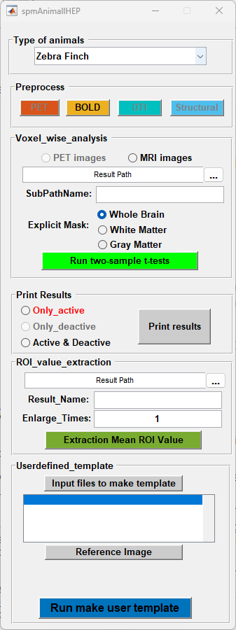

# spmAnimalIHEP

spmAnimalIHEP is a MATLAB/SPM toolbox for automated preprocessing, statistical analysis, result visualization, ROI extraction, and user-defined template construction for multimodal brain imaging data from multiple model animals.

The toolbox is designed for animal neuroimaging studies and supports multiple species, including rat, mouse, tree shrew, and zebra finch. Supported modalities include structural MRI, DTI, BOLD-fMRI, and FDG-PET.



## Features

- GUI-based workflow built with MATLAB GUIDE.
- Species-specific processing paths, templates, atlas files, masks, and MIP visualization resources.
- Preprocessing modules for PET, BOLD-fMRI, DTI, and structural MRI.
- Voxel-wise two-sample statistical analysis for PET and MRI images.
- Result rendering for activated, deactivated, or combined statistical maps.
- ROI mean-value extraction from atlas-defined regions.
- User-defined template construction from selected image files and a reference image.

## Supported Animals and Modalities

| Animal | PET | BOLD-fMRI | DTI | Structural MRI | Notes |
| --- | --- | --- | --- | --- | --- |
| Rat | Yes | Yes | Yes | Yes | Full GUI support in the current codebase |
| Mouse | No | Yes | Yes | Yes | PET button is disabled in the GUI |
| Tree shrew | Yes | No | No | No | PET and voxel-wise analysis support |
| Zebra finch | No | Yes | No | No | BOLD/MRI analysis support |

The main GUI also contains placeholder logic for monkey and parrot entries, but the corresponding complete replacement folders are not included in this repository.

## Main Modules

- `spmAnimalIHEP.m` / `spmAnimalIHEP.fig`: main GUI entry point.
- `PET_preprocess.m` / `.fig`: PET preprocessing, including header flipping, normalization, smoothing, masking, and optional SUVR image generation.
- `Bold_preprocess.m` / `.fig`: BOLD-fMRI preprocessing, including optional deletion of initial volumes, slice timing, realignment, normalization, smoothing, masking, and user-template/T2-template workflows.
- `DTI_preprocess.m` / `.fig`: DTI preprocessing for FA, MD, AD, and RD maps, including normalization, smoothing, and masking.
- `Structural_preprocess.m` / `.fig`: structural MRI segmentation and MIP adaptation of gray matter, white matter, and CSF outputs.
- `batch_programs/`: shared batch scripts used by the GUI.
- `replace_rat/`, `replace_mouse/`, `replace_Treeshew/`, `replace_ZebraFinch/`: species-specific processing functions, atlas resources, masks, templates, and visualization utilities.
- `Templates/`: template and tissue probability images used by preprocessing workflows.
- `Surface/`: surface resources for visualization.

## Requirements

- MATLAB.
- SPM, with SPM functions available on the MATLAB path.
- A working MATLAB environment that can run GUIDE-based `.fig` GUI files.
- NIfTI neuroimaging data compatible with SPM.

This toolbox calls SPM functions such as `spm_select`, `spm_vol`, `spm_read_vols`, `spm_write_plane`, `spm_jobman`, and SPM normalization/statistics utilities. Please install and configure SPM before running the toolbox.

## Quick Start

1. Open MATLAB.
2. Add this repository to the MATLAB path:

   ```matlab
   addpath('/path/to/spmAnimalIHEP')
   ```

3. Start the toolbox:

   ```matlab
   spmAnimalIHEP
   ```

4. Select an animal type from the main GUI.
5. Choose the appropriate preprocessing module: `PET`, `BOLD`, `DTI`, or `Structural`.
6. Select input NIfTI images and required templates through the GUI.
7. Run preprocessing, voxel-wise analysis, result printing, ROI extraction, or user-template construction as needed.

## Typical Workflows

### PET

The PET module supports optional header flipping, normalization to a selected template, MIP adaptation, smoothing, masking, and optional SUVR image generation using reference regions such as whole brain, gray matter, cerebellum, or pons when available for the selected animal.

### BOLD-fMRI

The BOLD module supports loading 4D NIfTI files and running selected preprocessing steps, including deletion of initial volumes, slice timing correction, realignment, normalization, smoothing, and brain masking. The code also contains options for normalization with user-defined templates and T2-based workflows.

### DTI

The DTI module processes diffusion-derived maps including FA, MD, AD, and RD. It can organize first-pass DTI outputs, compute RD from eigenvalue images, normalize maps, smooth them, and apply brain masks.

### Structural MRI

The structural module performs segmentation and adapts segmented tissue outputs for MIP-based visualization. It mainly handles gray matter, white matter, and CSF-related structural outputs.

### Voxel-wise Analysis and Visualization

The main GUI can run two-sample tests for PET or MRI images. Analysis can be performed using whole-brain, white-matter, or gray-matter masks where available. Statistical results can then be printed as active, deactive, or active-and-deactive maps.

### ROI Extraction

The ROI extraction panel exports mean ROI values from atlas images. Users can choose a result path, set a result name, and define the enlargement factor before extraction.

### User-defined Template

The user-defined template panel allows users to select input image files and a reference image, run template construction, and generate an average output from normalized files.

## Output Naming

The toolbox follows common SPM-style filename prefixes. Depending on the selected workflow, outputs may include prefixes such as:

- `n`: files after deletion of initial BOLD volumes.
- `a`: slice-timing corrected BOLD files.
- `r`: realigned BOLD files.
- `w`: normalized files.
- `s`: smoothed files.
- `Brain*`: masked brain images.
- `mwc1`, `mwc2`, `mwc3`: modulated segmented structural tissue images.

Exact outputs depend on the selected animal, modality, preprocessing options, and input file naming.


## Notes for GitHub Release

- Large imaging files are included in this repository as templates and atlas resources. Before publishing publicly, confirm that all included data can be redistributed.
- No license file is currently included. Add a `LICENSE` file before public release if others should be allowed to reuse or modify the toolbox.
- Consider adding a `.gitignore` file before committing, especially for `.DS_Store`, MATLAB autosave files, temporary outputs, generated NIfTI results, and local analysis folders.
